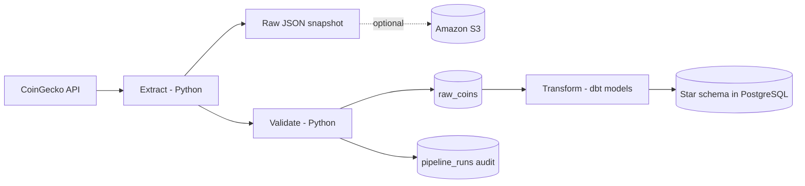

<div align="center">


<br/>

📍 **India** &nbsp;|&nbsp; 🎓 **Computer Engineering Graduate (2026)** &nbsp;|&nbsp; 📧 **jenil.khunt.d@gmail.com**

<br/>

<a href="mailto:jenil.khunt.d@gmail.com">
  
</a>
<a href="https://www.linkedin.com/in/jenilkhunt">
  
</a>
<a href="https://github.com/JENILKHUNT99">
  
</a>


<br/>


</div>

---

## 💫 About Me

```yaml
name: Jenil Khunt
role: Data Engineer
focus:
  - Production-grade ELT / ETL pipelines
  - Star schema data warehouse design
  - Workflow orchestration & data quality
currently_building: Hourly containerized crypto ELT pipeline (Airflow + dbt + PostgreSQL)
currently_learning: [Kafka, Spark, Streaming Architectures]
philosophy: "Load raw first, transform in SQL, test everything."
```

- 🔭 Building **production-grade ELT pipelines** that are containerized, orchestrated and tested
- 🏗️ Designing **star schema warehouses** that turn raw API data into analytics-ready models
- ✅ Big on **data quality gates, audit trails and idempotent (deterministic) keys**
- 🌱 Currently learning **streaming** with **Apache Kafka** and **Apache Spark**
- 💬 Ask me about **Airflow DAGs, dbt models & tests, dimensional modeling, Docker Compose**
- ⚡ Goal: build **reliable, maintainable data infrastructure** that analysts can trust

---

## 🚀 Featured Project

<div align="center">

### 🪙 Crypto Market ELT Pipeline

<a href="https://github.com/JENILKHUNT99/CryptoCurrency_ETL">
  
</a>

<p>


</p>

</div>

A **containerized, hourly-orchestrated ELT pipeline** for cryptocurrency market data. Python extracts from
the CoinGecko API, gates on data quality and loads raw records into PostgreSQL — then **dbt** transforms
them into a tested star schema, with **Apache Airflow** orchestrating the whole run every hour.

**What's inside**

- 🔁 **4-task Airflow DAG:** `apply_migrations → run_python_etl → dbt_run → dbt_test`
- 🧊 **Immutable raw snapshots** partitioned by UTC run date/hour, optionally synced to **AWS S3**
- ⭐ **dbt star schema:** `fact_crypto_prices` joined to `dim_coin`, `dim_category`, `dim_currency`, `dim_date`
- 🔑 **Deterministic fact keys** (`bitcoin_usd_20250720T100000000000Z`) — reprocessing never duplicates rows
- 🛡 **Quality gates + `pipeline_runs` audit trail**, with `MIN_VALID_RECORDS` failing the run early
- 🧱 **Versioned SQL migrations** applied automatically as the first DAG task
- ✅ **CI on GitHub Actions** running `pytest` and `ruff` on every push and pull request
- 🐳 **Fully Dockerized** — `docker compose up --build` brings up Airflow and PostgreSQL

**Pipeline architecture**



> **ELT over ETL:** the raw data is loaded *before* it is transformed. Python never reshapes the data —
> it only extracts, gates on quality and loads. Every transformation lives in versioned, tested SQL,
> so the raw layer can always be replayed without re-hitting the API.

<div align="center">
<a href="https://github.com/JENILKHUNT99/CryptoCurrency_ETL">
  
</a>
</div>

---

## 🛠 Tech Stack

<div align="center">

### 🐍 Languages & Databases


### ⚙️ Orchestration & Transformation
<p>


</p>

### 🗄 Data Modeling & Pipelines
<p>


</p>

### 🌐 Backend & APIs

<p>

</p>

### ☁️ DevOps & Cloud

<p>


</p>

### 📚 Currently Learning
<p>


</p>

</div>

---

## 🎯 Current Focus

| Area | What I'm Doing |
| :--- | :--- |
| 🔁 **Orchestration** | Hardening Airflow DAGs — retries, SLAs, idempotent task design |
| ⭐ **Warehouse Design** | Star schema modeling with dbt: staging → dimensions → facts |
| ✅ **Data Quality** | dbt tests (unique, not-null, relationships) + Python validation gates |
| 🌊 **Streaming** | Learning **Kafka** and **Spark** to move from batch to real-time |
| ☁️ **Cloud** | Deepening **AWS** (S3 layers, IAM, cost-aware storage patterns) |

---

## 📊 GitHub Stats

<div align="center">


<br/><br/>


<br/><br/>

**Contribution Graph**


</div>

---

## 💡 Data Engineering Philosophy

```python
class DataEngineer:
    def __init__(self):
        self.name = "Jenil Khunt"
        self.stack = ["Python", "Airflow", "dbt", "PostgreSQL", "Docker", "AWS"]
        self.principles = [
            "Load raw first — never lose the source of truth",
            "Validate at the gate, not after the damage",
            "Deterministic keys make reprocessing safe",
            "If it isn't tested, it isn't a pipeline",
            "Orchestration beats cron jobs",
        ]

    def build(self) -> str:
        return "Reliable data infrastructure analysts can trust"
```

---

<div align="center">

### 🤝 Let's Connect

I'm actively looking for **Data Engineer** opportunities.
If you're building data platforms, pipelines or warehouses — I'd love to talk.

<a href="mailto:jenil.khunt.d@gmail.com">
  
</a>
<a href="https://www.linkedin.com/in/jenilkhunt">
  
</a>

<br/><br/>

### *"Good data builds great decisions."*


</div>
